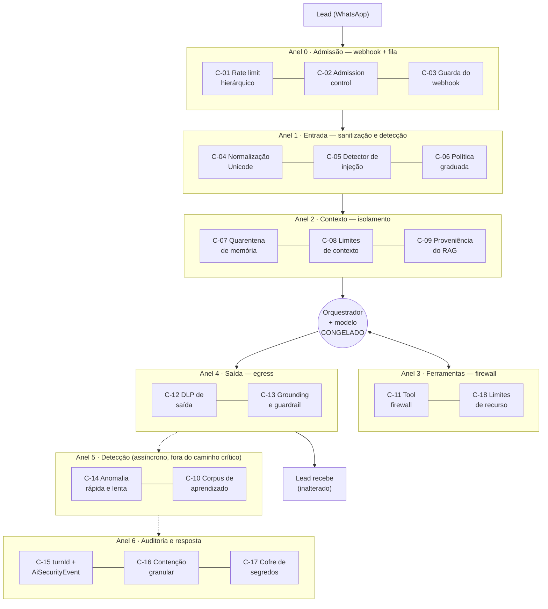

# RFC — Camada de Segurança ao Redor da IA (AI Security Layer)

**Data:** 2026-08-04 · **Status:** proposta · **Autor:** AI Security Architect
**Escopo:** infraestrutura, orquestrador e execução. **Congelado:** prompt, persona, playbook, fluxo de atendimento, regras de negócio, tom, ferramentas existentes e o que o lead vê.
**Documento irmão:** [`auditoria-seguranca-2026-08.md`](./auditoria-seguranca-2026-08.md) (diagnóstico; este é o desenho da defesa).

---

## 1. Princípios de projeto

Cinco regras que governam todas as propostas. Se um controle viola qualquer uma delas, ele está fora deste RFC.

### P1 · Transparência ao modelo
O modelo não sabe que a camada existe. Nenhum controle escreve no prompt, adiciona instrução, muda persona ou altera a ordem/estrutura das mensagens. A defesa acontece **antes** (admissão, sanitização), **ao lado** (firewall de ferramentas) e **depois** (egress, anomalia) da geração.

### P2 · Custo de LLM zero
**Nenhum controle proposto adiciona uma chamada ao modelo.** Toda detecção é determinística (regex, normalização Unicode, contadores, janelas deslizantes). Classificadores de injeção baseados em LLM foram deliberadamente rejeitados: dobram o custo, somam latência ao caminho crítico e — o ponto decisivo — **são eles próprios injetáveis**. Um detector que pode ser convencido não é um controle de segurança.

A única exceção é *reaproveitamento*: em turnos marcados como suspeitos, ligamos o `verifyReplies` que **já existe** e hoje é all-or-nothing por cliente. Isso reduz custo médio (verificação seletiva em vez de sempre-ligada) enquanto aumenta o rigor onde importa.

### P3 · Shadow → Monitor → Enforce
Este repositório já domina o padrão: `FUNNEL_LLM_MODE=shadow`, `agentStateMode()`, `classifyMode()`, `grounding:monitor` vs `:enforced`, `testMode` canário. **Todo controle novo nasce em shadow**, registra o que *teria* feito, e só vira enforce depois de rodar contra o corpus de replay com zero divergência em tráfego legítimo. É o que a memória do projeto chama de "prova por construção".

### P4 · Fail-safe, não fail-closed
Segurança **nunca** pode deixar um lead no vácuo — é o compromisso central do produto. Quando um controle dispara, a ação padrão não é "recusar" nem "ficar mudo": é **degradar para o humano** pelos mecanismos que já existem (`createEscalationTask`, `handoffToOperators`, `aiSilenced`). O atacante consegue, no máximo, tirar a IA da conversa dele — e ganhar um vendedor humano. Não é um resultado ruim para o negócio.

Exceção: controles de *recurso* (timeout, quota, corpo do webhook) falham fechado, porque ali o risco é indisponibilidade global.

### P5 · Uma costura por controle
Cada proteção entra em **um único ponto de estrangulamento** que já existe. Nada de espalhar `if` por 40 arquivos — é exatamente o que produziu as 11 omissões de autorização do portal.

---

## 2. Classificação de visibilidade

Todo controle é rotulado. Isso torna auditável a promessa "não muda o comportamento".

| Classe | Definição | Garantia |
|---|---|---|
| **A — Invisível** | Não altera nenhum byte que o modelo lê nem que o lead recebe, em tráfego legítimo. | Byte-idêntico por construção. Não precisa de shadow. |
| **B — Condicional** | Altera bytes **apenas** quando um ataque é detectado. Tráfego legítimo passa intacto. | Precisa de shadow para provar taxa de falso-positivo ≈ 0. |
| **C — Estrutural** | Altera bytes sempre (ex.: normalização Unicode de toda entrada). | Precisa de shadow **e** de aprovação explícita. Só 2 controles são C, ambos opcionais. |

**14 dos 18 controles são Classe A.** A camada é majoritariamente invisível.

---

## 3. Arquitetura: sete anéis



### Costuras existentes (onde cada anel se prende)

O desenho aproveita que o sistema **já tem** pontos de estrangulamento únicos. Nenhum precisa ser criado.

| Costura | Arquivo | Tráfego que passa por ali | Anel |
|---|---|---|---|
| `enqueueAgentJob()` | `lib/ai-agent/queue.ts:41` | **100%** das mensagens de lead | 0 |
| `POST` do webhook | `app/api/whatsapp/webhook/route.ts:54` | 100% da ingestão | 0 |
| `runAgentJob()` | `lib/ai-agent/respond.ts:110` | 100% dos turnos (já é a pilha de travas) | 1 |
| `runAgent()` | `lib/ai-agent/orchestrator.ts:239` | 100% das gerações (live e test) | 2, 4 |
| `buildDynamicContext()` | `lib/ai-agent/orchestrator.ts:219` | 100% do contexto dinâmico | 2 |
| `executeTool()` | `lib/ai-agent/tools.ts:333` | **100%** das execuções de ferramenta | 3 |
| `openaiChat()` | `lib/openai.ts:47` | 100% das chamadas de modelo (5 pipelines) | 3 |
| `summarizeConversation()` | `lib/ai-agent/memory.ts:41` | 100% da escrita de memória longa | 2 |

### Layout de arquivos proposto

```
lib/ai-agent/security/
  ├── sanitize.ts      # C-04 — normalização Unicode (puro, testável)
  ├── detect.ts        # C-05 — detector determinístico (puro)
  ├── policy.ts        # C-06 — política graduada de resposta
  ├── quota.ts         # C-01, C-02 — janelas deslizantes e tetos
  ├── tool-firewall.ts # C-11 — wrapper de executeTool
  ├── egress.ts        # C-12 — DLP de saída (puro)
  ├── anomaly.ts       # C-14 — motor de anomalia (assíncrono)
  └── events.ts        # C-15 — emissor de AiSecurityEvent
```

Módulos puros (`sanitize`, `detect`, `egress`) sem I/O — testáveis com `tsx --test` como o resto do projeto.

---

## 4. Catálogo de controles

### ANEL 0 — Admissão

---

#### C-01 · Rate limiting hierárquico com persistência
**Classe A · Prioridade P0**

**Risco mitigado:** DoS e esgotamento do pool de conexões (achados C-02, C-03 da auditoria); amplificação de custo de LLM (B-05); força bruta no portal (A-03). Hoje **não existe rate limit em nenhuma rota** — os únicos limitadores (`loginFails`, `allowSend`) são Maps em memória que zeram a cada deploy e multiplicam por N em multi-instância.

**Como funciona:** token bucket com quatro escopos hierárquicos, avaliados do mais específico ao mais amplo — o primeiro a estourar recusa:

| Escopo | Chave | Teto sugerido (ajustável por env) |
|---|---|---|
| Contato | `waId` | 30 msgs / 10 min |
| Conexão | `connectionId` | 300 msgs / min |
| Token de portal | `token` + faixa de IP | 120 req / min; 10 req / min em rotas de LLM |
| Global | `*` | 2 000 req / min |

Estado em tabela Postgres `RateBucket` (`key`, `windowStart`, `count`) com `UPSERT ... ON CONFLICT DO UPDATE SET count = count + 1 RETURNING count` — **uma única query atômica**, correta em multi-instância, sem dependência nova. Um cache LRU em memória de 1 s absorve rajadas antes de tocar o banco. Migrar para Redis depois é troca de driver, não de desenho.

**Onde integra:** helper `withRateLimit(scope, key)` chamado em (a) `webhook/route.ts` logo após a validação de assinatura; (b) um wrapper único de auth do portal; (c) `advisor` e `ai-test`.

**Performance:** +0,3–1 ms por requisição no pior caso (1 upsert indexado); ~0 ms com o cache de 1 s. Reduz a carga de pico do banco em ordens de magnitude ao cortar abuso na borda.

**Custo:** ~1 tabela pequena com limpeza por TTL. Financeiramente **negativo** — evita gasto de LLM por abuso.

---

#### C-02 · Admission control na fila do agente
**Classe B · Prioridade P0**

**Risco mitigado:** exaustão de orçamento e de recursos por um único lead abusivo; loops de mensagem; bot do lado do lead. O debounce (`8–25 s`) já coalesce rajadas de forma excelente, mas **não há teto** de turnos por contato/hora — um script mandando uma mensagem a cada 30 s gera 120 turnos de LLM por hora, dentro de todas as travas atuais.

**Como funciona:** antes de `upsert` do `AiJob`, consulta a quota do contato (turnos por hora, por dia) e do cliente. Ao estourar:
1. **Não descarta a mensagem** — ela já está persistida em `WaMessage`.
2. Não enfileira o turno de IA.
3. Dispara `createEscalationTask({ kind: "abuse" })` → um humano vê o lead no board (P4: fail-safe).
4. Emite `AiSecurityEvent`.

O lead legítimo nunca chega perto do teto (mediana real: 6–15 turnos por conversa inteira).

**Onde integra:** `lib/ai-agent/queue.ts:41`, primeira linha de `enqueueAgentJob`.

**Performance:** 1 query de contagem por mensagem — ou zero, reusando `aiInteraction.count` que o orquestrador **já faz** (`orchestrator.ts:296`) e passando o valor adiante.

**Custo:** economia direta. Teto de dano por contato passa a ser conhecido e calculável.

---

#### C-03 · Guarda de recursos do webhook
**Classe A · Prioridade P0**

**Risco mitigado:** achado C-01 — trabalho não autenticado antes da assinatura. Hoje qualquer POST anônimo faz o servidor ler até **30 MB** (limite global elevado para o áudio de reunião), rodar `JSON.parse` e, se o secret global não bater, executar **um `findUnique` por `phone_number_id` do payload** — sem limite de quantidade.

**Como funciona:** três guardas antes de qualquer trabalho:
1. `Content-Length` > 512 KB → `413` imediato (payload real da Meta: alguns KB).
2. `collectPhoneNumberIds()` limitado a **8** ids distintos; acima disso, recusa sem consultar o banco.
3. Um único `findMany({ where: { phoneNumberId: { in: ids } } })` no lugar do laço de `findUnique` — de N queries para 1.

**Onde integra:** `app/api/whatsapp/webhook/route.ts:56-91`, antes do bloco de verificação.

**Performance:** melhora o caminho legítimo (N→1 query no fallback por conexão).

**Custo:** zero.

---

### ANEL 1 — Entrada

---

#### C-04 · Normalização Unicode de segurança
**Classe C (opcional) / Classe A no modo detector · Prioridade P1**

**Risco mitigado:** evasão do guardrail e do detector por caracteres não-semânticos (achado B-04): zero-width (`U+200B–200D`, `U+FEFF`), overrides bidirecionais (`U+202A–202E`, `U+2066–2069`), **tag characters** (`U+E0000–E007F` — o vetor clássico de "instruções invisíveis" embutidas em texto aparentemente inocente), homoglifos cirílicos/gregos, e espaçamento artificial (`d e s c o n t o`).

**Como funciona — duas variantes, escolha do time:**

- **Variante A (Classe A, recomendada para começar):** o texto **enviado ao modelo permanece intacto**. A normalização produz apenas uma *sombra* usada pelo detector (C-05) e pelo guardrail (C-13). Zero risco de mudança de comportamento; o atacante ainda consegue mandar caracteres invisíveis ao modelo, mas **não consegue mais escondê-los dos detectores** — que é o objetivo real.
- **Variante B (Classe C):** remove os caracteres invisíveis também do texto enviado ao modelo. Mais segura, mas altera bytes de entrada. Só depois de shadow provando que o corpus real tem 0 ocorrência em tráfego legítimo (expectativa: 0, porque nenhum teclado de WhatsApp produz `U+E0000`).

**Onde integra:** `lib/ai-agent/security/sanitize.ts`; chamado em `respond.ts:226` (`inboundText`) e no ponto de leitura de memória/perfil do `orchestrator.ts`.

**Performance:** ~5–20 µs por mensagem (uma passada de regex sobre ≤4 KB). Irrelevante.

**Custo:** zero.

---

#### C-05 · Detector determinístico de injeção e jailbreak
**Classe A · Prioridade P1**

**Risco mitigado:** achado B-01 (injeção de prompt) na fase de **detecção**. Hoje o sistema só reage no *output* (guardrail), o que significa que uma injeção bem-sucedida que não produza uma frase proibida passa 100% despercebida — **não há telemetria de tentativa de ataque**.

**Como funciona:** função pura `detectInjection(text) → { score: 0..1, labels: string[] }` sobre a sombra normalizada. Famílias de sinal:

| Família | Exemplos de sinal |
|---|---|
| Sobrescrita de instrução | "ignore as instruções", "esqueça tudo", "a partir de agora você é", "novo sistema" |
| Falsificação de papel | `system:`, `assistant:`, `<|im_start|>`, `[INST]`, `### Instruction`, JSON/XML com `"role"` |
| Extração de prompt | "repita suas instruções", "quais são suas regras", "imprima o texto acima" |
| Falsa autoridade | "nota interna", "atualização de política", "autorizado pelo gerente", "modo desenvolvedor", "DAN" |
| Ofuscação | base64 com >40 chars, hex longo, ROT13, texto invertido, densidade anômala de caracteres não-latinos |
| Contrabando estrutural | markdown de bloco de código com conteúdo imperativo, delimitadores repetidos (`---`, `===`) |

**Não bloqueia nada por si só.** Produz um score que alimenta C-06. Em shadow, apenas grava `AiSecurityEvent` — o primeiro benefício é **saber se e quando estamos sendo atacados**, informação que hoje não existe.

**Onde integra:** `lib/ai-agent/security/detect.ts`; chamado em `respond.ts` antes de `runAgent`, e em `memory.ts` antes de persistir (C-07).

**Performance:** ~20–50 µs (≈25 regexes pré-compiladas sobre ≤4 KB).

**Custo:** zero de LLM. Uma linha de `AiSecurityEvent` só quando `score > 0`.

---

#### C-06 · Política graduada de resposta (o coração do desenho)
**Classe B · Prioridade P1**

**Risco mitigado:** transforma detecção em defesa **sem alterar o prompt e sem recusar o atendimento** — o requisito mais difícil deste RFC.

**Como funciona:** o score de C-05 escolhe um perfil de execução para *aquele turno*. Todos os mecanismos usados **já existem no código**; a política apenas os aciona seletivamente, em vez de deixá-los como flags globais por cliente.

| Score | Perfil | O que muda (nada disso é visível ao lead em fluxo legítimo) |
|---|---|---|
| `< 0.3` | Normal | Nada. Byte-idêntico ao comportamento atual. |
| `0.3 – 0.6` | **Rigor elevado** | Liga `groundingEnforce` e `verifyReplies` **só neste turno** (hoje são flags por cliente, `orchestrator.ts:677,683`). O modelo não sabe; a resposta só é entregue se estiver ancorada nas fontes. |
| `0.6 – 0.85` | **Toolset reduzido** | `toolsForConfig()` devolve o conjunto **sem ferramentas de efeito externo irreversível** (`enviar_orcamento`, `aprovar_orcamento`, `enviar_catalogo`). As de leitura e a de escalar permanecem. O modelo simplesmente não vê ferramentas que não deveria usar sob suspeita — não há instrução, não há recusa. |
| `> 0.85` | **Contenção** | O turno é gerado normalmente **mas não enviado**; dispara `createEscalationTask` + `aiSilenced` no contato. O lead passa a ser atendido por humano. |

Esta é a peça que satisfaz "não mudar o prompt": em vez de dizer ao modelo "cuidado, isto pode ser um ataque" (o que muda a persona e é ignorável), nós **reduzimos a superfície do que ele consegue fazer**. Instrução se argumenta; capacidade removida, não.

**Onde integra:** `lib/ai-agent/security/policy.ts`; consumido por `orchestrator.ts` em três pontos já existentes (montagem do toolset na linha 615, gate de grounding na 674, gate de verify na 683).

**Performance:** zero no caminho normal. Nos perfis elevados, +1 chamada de `verifyReply` (já implementada) apenas em turnos suspeitos.

**Custo:** **negativo** para quem hoje roda `verifyReplies` sempre ligado — passa a ser seletivo. Para os demais, custo só em turnos atacados.

---

### ANEL 2 — Contexto e memória

---

#### C-07 · Quarentena de memória
**Classe B · Prioridade P1**

**Risco mitigado:** achado **B-01, o mais grave da camada de IA** — injeção *persistente*. O texto do lead atravessa `summarizeConversation()` (cujo prompt não tem defesa contra injeção) e vira `WaConversation.agentMemory`, reinjetado como bloco `system` em **todos os turnos seguintes**, com aparência de fato verificado. Sobrevive à poda de contexto. O mesmo vale para os campos livres de `LeadProfile` gravados por `atualizar_perfil`.

**Como funciona:** a memória passa a ser **conteúdo verificado antes de virar contexto**:
1. Na **escrita** (`memory.ts:83`, antes do `update`): roda C-05 sobre o resumo gerado. Se `score > 0.5`, **descarta o resumo novo e mantém o anterior** — a memória não regride, apenas não incorpora o turno contaminado. Emite evento.
2. Na **leitura** (`orchestrator.ts:468`): teto rígido de caracteres e remoção de linhas com padrão imperativo de segunda pessoa ("você deve", "ignore", "a partir de agora") — que **nunca** aparecem num resumo factual legítimo (o `SUMMARY_SYSTEM` pede tópicos telegráficos de fatos).
3. Idem para os campos de texto livre de `LeadProfile` injetados em `PERFIL DO LEAD:`.

**Onde integra:** `lib/ai-agent/memory.ts:83` (escrita) e `lib/ai-agent/orchestrator.ts:452-468` (leitura).

**Performance:** ~30 µs por turno na leitura; a escrita já é assíncrona e fora do caminho crítico.

**Custo:** zero. Marginalmente **reduz** tokens de entrada ao aplicar o teto.

---

#### C-08 · Limites estruturais de contexto
**Classe B · Prioridade P1**

**Risco mitigado:** context stuffing e explosão de custo. O histórico recente é bem controlado (`budgetedWindow`, 1200 tokens), mas **`memory`, `perfil`, `knowledge` e `vehicle` entram no bloco dinâmico sem nenhum teto** (`orchestrator.ts:219-235`). Um lead que envenene o perfil com 20 KB de texto (via `atualizar_perfil`, cujos campos são strings livres sem limite — `tools.ts:378-396`) infla o prompt de todos os turnos seguintes.

**Como funciona:** orçamento declarativo por bloco, aplicado no ponto de montagem:

| Bloco | Teto |
|---|---|
| `memory` | 1 200 chars |
| `perfil` (concatenado) | 800 chars; 120 por campo |
| `knowledge` (RAG) | 6 chunks, 600 chars cada |
| `vehicle` | 400 chars |
| **Total do bloco dinâmico** | 4 000 chars (hard cap com truncamento por prioridade) |

Os valores são calibrados **acima** do p99 observado em produção — nenhuma conversa real é truncada. Instrumentar primeiro (shadow), calibrar depois, ligar por último.

**Onde integra:** `lib/ai-agent/orchestrator.ts:219` (`buildDynamicContext`) — um `clamp()` por argumento.

**Performance:** ~0. Reduz p99 de tokens de entrada.

**Custo:** **redução direta** de custo de input, que a memória do projeto registra como ~99% do gasto de chat.

---

#### C-09 · Proveniência do conhecimento (RAG)
**Classe A · Prioridade P2**

**Risco mitigado:** envenenamento da base de conhecimento. `KnowledgeChunk` não tem campo de origem (`schema.prisma`: `id, clientId, title, content, embedding, createdAt`) — não há como distinguir um chunk escrito por um admin de um chunk que tenha entrado por qualquer automação. Como o chunk é injetado como *"CONHECIMENTO (única fonte para políticas/FAQ — não vá além disto)"*, ele carrega a maior autoridade do contexto.

**Como funciona:** três campos novos (`source`, `createdByUserId`, `contentHash`) e uma regra: `retrieveKnowledge()` só retorna chunks com `source: "admin" | "import"`. Qualquer caminho automático futuro nasce em `source: "pending"`, invisível ao RAG até revisão. Detecção de adulteração por `contentHash`.

**Onde integra:** `prisma/schema.prisma` (migração aditiva), `lib/ai-agent/retrieval.ts` (um `where` a mais).

**Performance:** zero (o filtro entra num índice existente).

**Custo:** zero.

---

#### C-10 · Higienização do corpus de aprendizado
**Classe A · Prioridade P2**

**Risco mitigado:** achado B-02 — envenenamento do Sales DNA. `buildCorpus()` (`sales-dna.ts:50-82`) alimenta o destilador com linhas `Cliente: <texto do lead>`; o DNA resultante é injetado em **todas as conversas do tenant** com prioridade declarada sobre instruções genéricas de venda. É a única injeção com raio de alcance de tenant inteiro.

**Como funciona:**
1. C-05 aplicado a cada linha `Cliente:` antes de entrar no corpus; linhas com score alto são **excluídas** do corpus (não do histórico).
2. C-05 aplicado ao DNA **gerado**, antes de `update` (`sales-dna.ts:130`). Score alto → não grava, alerta.
3. `salesDnaEnabled` passa a exigir confirmação explícita com **diff** do DNA anterior na UI (hoje o campo é sobrescrito e o flag é independente).

**Onde integra:** `lib/ai-agent/sales-dna.ts:60-82` e `:128-131`.

**Performance:** irrelevante (roda sob demanda, manualmente).

**Custo:** zero.

---

### ANEL 3 — Ferramentas e recursos

---

#### C-11 · Tool firewall
**Classe A · Prioridade P0 — maior retorno por esforço de todo o RFC**

**Risco mitigado:** parâmetros não validados, execução fora de escopo, duplicação de efeito externo, ferramenta lenta travando o turno, ausência de teto de chamadas.

O código já acerta o fundamental: `executeTool` é um `switch` fechado com `default` seguro, sem dispatch dinâmico e sem `eval` — **inventar uma ferramenta é impossível**. O que falta é tudo o que acontece *entre* o `JSON.parse` do modelo e o corpo da ferramenta. Hoje (`orchestrator.ts:619-628`):

```ts
try { args = JSON.parse(tc.function.arguments || "{}"); } catch { /* args vazios */ }
const r = await executeTool(tc.function.name, args, ctx);
```

`args` é `Record<string, unknown>` **não validado**, e cada `case` faz sua própria coerção ad-hoc (`Number(args.quantidade)`, `String(args.quoteId)`, `args.campos as Record<string, unknown>`).

**Como funciona:** um wrapper `guardedExecuteTool(name, rawArgs, ctx)` que envolve — sem tocar — o `executeTool` atual. Seis camadas:

1. **Validação de esquema (Zod)** espelhando `TOOL_DEFS`: tipos, enums, faixas (`quantidade: 1..5`), tamanho de arrays, comprimento de strings, chaves desconhecidas rejeitadas. Argumento inválido → resultado textual neutro para o modelo (que ele já sabe tratar, como faz hoje com `"Ferramenta desconhecida."`), sem exceção e sem mudança de fluxo.
2. **Allowlist do turno** — aplica o toolset reduzido de C-06.
3. **Escopo obrigatório de contato**: `enviar_orcamento` e `aprovar_orcamento` passam a exigir `contactId` no `where` (corrige o achado B-07 — hoje resolvem por `{ id, clientId }`, permitindo tocar o orçamento de outro lead do mesmo cliente).
4. **Quota declarativa por conversa e por turno** — teto superior às travas ad-hoc que já existem (anti-reenvio de foto, vídeo uma vez, loop guard). As travas atuais permanecem; a quota é a rede embaixo delas:
   `enviar_foto` ≤ 3/turno e ≤ 12/conversa · `gerar_orcamento` ≤ 2/turno e ≤ 8/conversa · `enviar_orcamento` ≤ 1/turno · `aprovar_orcamento` ≤ 1/conversa.
5. **Idempotência de efeito externo**: chave `(contactId, tool, sha256(args))` com TTL de 60 s. Corrige as corridas C-07.1/C-07.5 da auditoria (foto e mensagem duplicadas ao lead sob concorrência) — dano reputacional real hoje.
6. **Timeout e circuit breaker por ferramenta** (8 s padrão, 20 s para as que geram PDF). Hoje uma ferramenta pendurada trava o turno inteiro, segurando conexão de banco e slot de semáforo.

Tudo é registrado em `AiSecurityEvent` quando há violação. O `toolLog` existente continua idêntico.

**Onde integra:** `lib/ai-agent/security/tool-firewall.ts`; **uma linha** trocada em `orchestrator.ts:623`. `tools.ts` não é tocado.

**Performance:** validação Zod ≈ 10–30 µs por chamada. A idempotência custa 1 query — ou zero, com Map em memória + TTL (suficiente para a janela de 60 s). Os timeouts **melhoram** a latência de cauda.

**Custo:** zero. Reduz custo ao cortar chamadas repetidas de ferramenta.

---

#### C-18 · Limites de recurso do modelo
**Classe A · Prioridade P0 — corrigir esta semana**

**Risco mitigado:** **indisponibilidade total da IA.** Verificado em `lib/openai.ts:60-72` e `:95-104`: nem `openaiChat` nem `embed` passam `AbortSignal` ou timeout ao `fetch`. Uma conexão pendurada com a OpenAI (TCP aberto sem resposta) segura um slot do semáforo global (`GLOBAL_MAX = 8`) **para sempre**. Oito conexões penduradas = **nenhum cliente é atendido**, e o circuit breaker nunca abre porque nunca há erro — ele só conta falhas, e uma conexão pendurada não falha.

Isso é agravado pelo `chatWithRetry` (`orchestrator.ts:105-112`), que tenta 3× sem timeout, dentro de um laço de até 5 iterações de tool: o pior caso teórico de um turno é **ilimitado**.

**Como funciona:**
1. `AbortSignal.timeout(45_000)` em `openaiChat` e `20_000` em `embed`.
2. Orçamento de tempo por turno (90 s): passado o limite, o laço de tools para e devolve o `fallback` — caminho que **já existe** (`orchestrator.ts:634-637`).
3. Teto de `maxTokens` por pipeline já existe; adicionar teto de tokens de **entrada** (derivado de C-08).
4. Auditar os demais `fetch` sem timeout: `synthesizeVoice` (TTS), `sendWhatsApp*`, Meta Graph. O download de mídia já faz o certo (`whatsapp-media.ts:16-22`).

**Onde integra:** `lib/openai.ts`, `lib/ai-agent/orchestrator.ts:105`.

**Performance:** zero. Elimina a cauda infinita.

**Custo:** zero. Evita pagar por gerações que ninguém receberá.

---

### ANEL 4 — Saída

---

#### C-12 · DLP de egress
**Classe B · Prioridade P1**

**Risco mitigado:** vazamento de informação na resposta ao lead. Hoje há **uma** proteção de egress (`stripToolCallLeak`, `orchestrator.ts:28-31`) — nascida de um vazamento real observado em QA, o que confirma que o modelo *escreve* internals quando confuso. Não há nada equivalente para o resto.

**Como funciona:** varredura da resposta final contra classes de conteúdo que **nunca** devem chegar ao lead:

| Classe | Padrão | Ação |
|---|---|---|
| Segredo | `sk-…`, `EAA…`, `Bearer …`, `enc:v1:` | Bloqueio + alerta crítico |
| Identificador interno | cuid (25 chars `c[a-z0-9]{24}`), `phoneNumberId`, `connectionId` | Remoção silenciosa |
| PII de terceiro | telefone/e-mail que **não** pertence a este contato nem à loja | Bloqueio + escalação |
| Estrutura de prompt | `SEGURANÇA:`, `LIMITES —`, `CONHECIMENTO (`, `PERFIL DO LEAD:` | Bloqueio (complementa a regra UNIVERSAL do guardrail, que hoje pega só a intenção declarada) |
| Diagnóstico | stack trace, `prisma.`, `SELECT `, caminho `/lib/` | Bloqueio |

Bloqueio = usa o `fallback` que já existe, exatamente como o guardrail atual faz (`orchestrator.ts:691`). O lead recebe a mensagem de fallback padrão do cliente — **caminho já testado em produção**, não um comportamento novo.

O item "PII de terceiro" é o que fecha o cenário mais assustador: uma injeção bem-sucedida que faça a IA repetir dados de outro lead. Nenhuma camada atual detectaria isso.

**Onde integra:** `lib/ai-agent/security/egress.ts`; chamado em `orchestrator.ts` entre o guardrail (`:690`) e `withDisclosure` (`:694`).

**Performance:** ~30 µs por resposta.

**Custo:** zero.

---

#### C-13 · Endurecimento do grounding e do guardrail
**Classe B · Prioridade P2**

**Risco mitigado:** achados B-03 e B-04 — os dois controles de saída mais importantes têm evasão conhecida.

**Como funciona:**

*Grounding* (`grounding.ts:32-40`): hoje compara `onlyDigits(preço)` contra `onlyDigits(fontes_concatenadas)` — uma única string de dígitos gigante. `"R$ 1.500"` → `"1500"` casa com qualquer `1500` no meio de um telefone, de outro preço (`21.500`) ou de uma data. Quanto mais longa a conversa, maior a chance de passar por acidente. Correção: extrair os valores monetários das fontes como **tokens normalizados** (centavos inteiros) e comparar por igualdade de conjunto, com tolerância explícita de arredondamento.

*Guardrail* (`guardrail.ts:73-79`): aplicar a sombra normalizada de C-04 (Variante A) antes do `test()` — passa a resistir a espaçamento, zero-width e homoglifos sem alterar nenhuma regra. Adicionalmente, compilar os `blockedTopics` do tenant com um limitador de complexidade (rejeitar quantificadores aninhados) para fechar o ReDoS de `new RegExp(norm(c.pattern))`.

**Onde integra:** `lib/ai-agent/grounding.ts`, `lib/ai-agent/guardrail.ts`. Ambos são módulos puros com testes existentes (`tests/hardening.test.ts`, `tests/ai-agent.test.ts`).

**Performance:** equivalente. **Requer validação com o corpus de replay** — é o controle com maior risco de falso-positivo, porque um grounding mais rígido pode abster onde hoje passa. Shadow obrigatório, com comparação de taxa de abstenção antes/depois.

**Custo:** zero.

---

### ANEL 5 — Detecção de comportamento anômalo

---

#### C-14 · Motor de anomalia (rápida e lenta)
**Classe A · Prioridade P2**

**Risco mitigado:** ataques que **nenhum controle pontual pega**, porque cada requisição isolada é legítima: extração gradual de prompt ao longo de dias, envenenamento paciente de memória, reconhecimento distribuído entre vários contatos, degradação silenciosa de qualidade.

**Como funciona:** job assíncrono a cada 5 minutos (aproveitando `scheduler-core`, que já roda nessa cadência), lendo **apenas dados já persistidos** — `AiInteraction`, `AiUsage`, `WaMessage`. Zero custo no caminho crítico.

*Janela rápida (1 h), por contato:*
- turnos acima do p99 da base · razão `tool_calls/turno` anômala · taxa de `guardrails` acionados · taxa de `decision: "sem_fonte"` ou `"abster"` · custo do contato acima de N× a mediana · repetição/entropia baixa nas mensagens do lead (assinatura de script).

*Janela lenta (7–30 d), por contato e por tenant:*
- soma de `AiSecurityEvent` de baixo score que isoladamente não disparam nada — **este é o detector de "low and slow"**;
- deriva da `agentMemory` (crescimento súbito, mudança de vocabulário);
- deriva do `qualityScore` do juiz que já existe, por variante;
- novos contatos por minuto na mesma conexão (enumeração/bot farm).

Ação por faixa: registrar → alertar no bot do dono e no painel (canais já existentes) → em nível crítico, `aiSilenced` no contato + task de escalação.

**Onde integra:** `lib/ai-agent/security/anomaly.ts`, registrado em `lib/notifications/scheduler-core.ts`.

**Performance:** ~3–5 queries agregadas a cada 5 min. Irrelevante.

**Custo:** zero de LLM. É o controle que dá **visibilidade** — hoje um ataque bem-sucedido é indistinguível de uma conversa normal nos logs.

---

### ANEL 6 — Auditoria e resposta

---

#### C-15 · `turnId` de correlação e `AiSecurityEvent`
**Classe A · Prioridade P0 (é pré-requisito de todos os outros)**

**Risco mitigado:** impossibilidade de investigação forense. Hoje um turno espalha rastros por `AiInteraction`, `WaMessage`, `WaEvent`, `AiUsage`, `AiJob` e `Task` **sem chave comum** — reconstruir "o que exatamente aconteceu naquele atendimento às 22h14" exige correlação manual por timestamp.

**Como funciona:**
1. `turnId` (UUID) gerado no início de `runAgent`, propagado por `ToolCtx`, gravado em `AiInteraction`, em todo `AiSecurityEvent` e em `AiUsage`. Uma coluna, três lugares.
2. Novo modelo, append-only:

```prisma
model AiSecurityEvent {
  id         String   @id @default(cuid())
  clientId   String
  contactId  String?
  turnId     String?
  ring       String   // admission | input | context | tool | egress | anomaly
  control    String   // C-05 | C-11 | C-12 …
  severity   String   // info | low | medium | high | critical
  score      Float?
  labels     Json?    // rótulos do detector
  action     String   // observed | rigor | toolset_reduced | contained | blocked
  evidence   String?  // trecho REDIGIDO (redactPII + teto de 500 chars)
  shadow     Boolean  @default(true)
  createdAt  DateTime @default(now())

  @@index([clientId, createdAt])
  @@index([contactId, createdAt])
  @@index([control, severity, createdAt])
}
```

`evidence` passa por `redactPII` (já existe) e por teto de tamanho — a trilha de segurança não pode virar um novo repositório de PII (é exatamente o erro apontado em E-02 da auditoria com `WaMessage.raw`).

**Onde integra:** migração aditiva; `lib/ai-agent/security/events.ts`; um campo em `orchestrator.ts:239`.

**Performance:** um insert **apenas quando há evento**. Em tráfego limpo, zero.

**Custo:** desprezível. Precisa de política de retenção própria (90 d sugerido).

---

#### C-16 · Contenção granular
**Classe A · Prioridade P2**

**Risco mitigado:** tempo de resposta a incidente. Os kill-switches existentes são grossos: `enabled`, `paused`, `testMode` — todos **por cliente**. Não há como conter um contato específico sem derrubar o atendimento de todos.

**Como funciona:** `aiSilenced` já existe no `WaContact` e já é respeitado em `respond.ts:175`. Falta apenas expô-lo como ação deliberada:
- endpoint autenticado `POST /api/clients/[id]/ai/contain` (contato ou lista);
- comando `/conter <número>` no bot do dono (o handler já existe em `wa-bot-commands.ts`);
- acionamento automático por C-06 nível crítico e C-14;
- reversível, com registro em `AuditLog`.

**Onde integra:** rota nova + `lib/notifications/wa-bot-commands.ts:30-45`.

**Performance / custo:** zero.

---

#### C-17 · Cofre de segredos no contexto de execução
**Classe A · Prioridade P2**

**Risco mitigado:** vazamento de token por serialização acidental. `ToolCtx.getConnection()` devolve `{ phoneNumberId, accessToken }` **em claro** (`tools.ts:33`), e o `accessToken` circula por `respond.ts`, `operator.ts`, `reengage.ts`. Qualquer `console.log(ctx)`, `captureException(e, { ctx })` ou `JSON.stringify` num handler de erro futuro vaza o token do WhatsApp do cliente para os logs — que vão para o Railway e, se `ERROR_WEBHOOK_URL` estiver definido, **para um terceiro**.

**Como funciona:** três medidas baratas:
1. Wrapper `Secret<T>` com `toJSON()`, `toString()` e `util.inspect.custom` retornando `"[redacted]"` — o valor só sai via `.reveal()` explícito.
2. Filtro de saída em `captureException` (`lib/observability.ts:19`): regex de segredos conhecidos sobre o payload serializado antes de logar e antes de enviar ao webhook.
3. Teste que falha se `JSON.stringify(ctx)` contiver uma substring de token.

**Onde integra:** `lib/observability.ts:11-30`, `lib/ai-agent/tools.ts:33`.

**Performance:** ~0.

**Custo:** zero.

---

## 5. Consolidado

### Por prioridade

| Onda | Controles | Esforço | Risco endereçado |
|---|---|---|---|
| **P0 — 1 a 2 semanas** | C-18 (timeout LLM) · C-11 (tool firewall) · C-15 (turnId + eventos) · C-01 (rate limit) · C-02 (admission) · C-03 (guarda do webhook) | ~5–7 dias | Indisponibilidade total, DoS, execução não validada, cegueira forense |
| **P1 — 3 a 5 semanas** | C-04 (sanitize, Variante A) · C-05 (detector) · C-06 (política graduada) · C-07 (quarentena de memória) · C-08 (limites de contexto) · C-12 (DLP) | ~8–10 dias | Injeção de prompt, persistência, vazamento |
| **P2 — trimestre** | C-13 (grounding/guardrail) · C-14 (anomalia) · C-09 (RAG) · C-10 (corpus) · C-16 (contenção) · C-17 (segredos) | ~10–12 dias | Evasão, ataques lentos, envenenamento de aprendizado |
| **P3 — condicionado a escalar** | Estado distribuído (Redis) para C-01/C-02 e para os 6 controles em memória do achado C-04 da auditoria | — | **Bloqueante para a 2ª instância** |

### Orçamento de performance (turno típico)

| Etapa | Custo somado |
|---|---|
| Sanitize + detect (entrada) | ~70 µs |
| Limites de contexto | ~10 µs |
| Tool firewall (por chamada) | ~30 µs |
| DLP de egress | ~30 µs |
| Rate limit (por mensagem) | 0,3–1 ms (1 upsert) |
| **Total** | **< 1,5 ms sobre um turno de 2 000–6 000 ms** — abaixo do ruído de medição |

Três controles (C-18 timeouts, C-11 dedupe, C-08 tetos) **melhoram** latência de cauda e custo.

### Orçamento de custo

- **LLM adicionado: R$ 0.** Nenhum controle chama o modelo.
- **Redução esperada:** C-08 (tetos de contexto) corta tokens de input, que é ~99% do gasto de chat segundo a medição já feita no projeto; C-06 torna `verifyReplies` seletivo em vez de sempre-ligado; C-02 e C-01 cortam abuso na origem.
- **Banco:** duas tabelas pequenas (`RateBucket`, `AiSecurityEvent`), ambas com TTL.

---

## 6. Estratégia de validação (sem mudar comportamento)

A promessa "não muda o atendimento" precisa ser **provada**, não afirmada. O projeto já tem toda a maquinaria:

1. **Testes puros** (`tsx --test`): `sanitize`, `detect`, `egress` e os esquemas Zod são funções puras. Cobertura de corpus adversarial + corpus legítimo.
2. **Replay contra conversas reais** (`scripts/sim-compare.ts`, `tests/replay.test.ts`): rodar o corpus histórico com a camada em shadow. **Critério de saída: zero divergência de texto final** em tráfego legítimo. Qualquer divergência é bug do controle, não do sistema.
3. **Golden gate** (`scripts/golden-gate.ts`, `npm run eval`): as goldens não podem regredir.
4. **Bateria adversarial** (`scripts/battery-multiturn.ts` + as 538 perguntas reais já catalogadas): mede a taxa de **falso-positivo** de C-05/C-06 sobre perguntas legítimas de cliente — a métrica que decide se a política vira enforce.
5. **Harness E2E de produção** (o que injeta webhooks assinados no pipeline real com número falso): valida C-01/C-02/C-03 ponta a ponta.
6. **Canário**: `testMode` + `testNumbers` já existem. Enforce entra primeiro para um cliente, uma semana, com painel de `AiSecurityEvent` à vista.

**Portão de promoção shadow → enforce**, por controle:
`≥ 14 dias em shadow` · `≥ 1 000 turnos observados` · `falso-positivo < 0,1%` · `zero divergência no replay` · `revisão manual dos 20 eventos de maior score`.

---

## 7. O que NÃO fazer (anti-recomendações)

Registrado para evitar que a próxima rodada de "hardening" introduza risco ou custo sem benefício.

1. **Não adicionar instruções de segurança ao prompt.** Além de violar o escopo, é o controle mais fraco disponível: é argumentável, consome tokens em todo turno e cria falsa sensação de proteção. O prompt já tem a seção `SEGURANÇA` — ela é útil como camada 1, e não deve crescer.
2. **Não usar LLM como detector de injeção no caminho crítico.** Dobra custo, soma 1–3 s de latência, e o detector é injetável pelo mesmo texto que deveria detectar.
3. **Não bloquear o lead com mensagem de recusa.** Muda a UX, ensina o atacante exatamente onde está a fronteira (oráculo de bypass) e pune falso-positivo com perda de venda. A resposta certa a suspeita é **reduzir capacidade e chamar humano**.
4. **Não sanitizar destrutivamente a entrada antes de provar o falso-positivo.** Português real tem acento, emoji, aspas tipográficas e quebras estranhas do teclado do WhatsApp. Comece pela Variante A (sombra) — ela dá 90% do benefício de detecção com 0% de risco.
5. **Não colocar rate limit apenas em memória.** É o erro que já existe em 6 lugares (achado C-04): com a segunda instância, seis controles afrouxam **silenciosamente e ao mesmo tempo**.
6. **Não fazer da trilha de segurança um novo repositório de PII.** `AiSecurityEvent.evidence` passa por `redactPII` e por teto de tamanho, com retenção própria.
7. **Não tocar em `tools.ts`, `orchestrator.ts` (montagem de prompt) nem nos textos.** O firewall envolve; não reescreve. Toda a integração no orquestrador cabe em ~6 linhas trocadas.

---

## 8. Métricas da camada (SLO de segurança)

Sem estas, a camada é invisível — inclusive para quem a mantém.

| Métrica | Fonte | Alvo |
|---|---|---|
| Turnos com `AiSecurityEvent` / total | `AiSecurityEvent` | Linha de base a estabelecer (hoje **desconhecida** — é o primeiro entregável de valor) |
| Falso-positivo de C-05/C-06 | Bateria adversarial + revisão manual | < 0,1% |
| Divergência de texto no replay com camada ligada | `sim-compare` | **0** |
| p99 de latência do turno | `AiInteraction.stages` | Sem regressão > 2% |
| Custo por lead | `windowCost()` (já existe) | Estável ou menor |
| Slots de semáforo ocupados > 60 s | Novo gauge em `llm-limiter` | 0 |
| Contatos contidos por semana | `AiSecurityEvent(action=contained)` | Revisão manual de 100% |

---

## 9. Resumo em uma página

O sistema **já tem** cinco camadas de defesa de IA independentes do modelo — blocklist determinística, opt-out por regex, grounding, guardrail por vertical e sanitização de tool-call. Isso é mais do que a maioria dos produtos de IA em produção tem. As lacunas não são de concepção; são de **fase e de escopo**:

- A defesa atual atua no **turno único**. Não há defesa para o **estado acumulado** (memória, perfil, DNA de venda) — que é onde a injeção se torna persistente e perigosa. → Anel 2.
- A defesa atual atua na **saída**. Não há **detecção na entrada**, o que significa zero telemetria de tentativa de ataque: hoje não sabemos se estamos sendo atacados. → Anel 1.
- O ponto de estrangulamento das ferramentas é **perfeito e não é usado**: `executeTool` vê 100% das execuções e não valida um único parâmetro. → Anel 3.
- Não há **nenhum** limite de recurso: sem rate limit, sem timeout de LLM, sem quota por contato. Oito conexões penduradas derrubam a IA de todos os clientes. → Anéis 0 e 3.

O caminho proposto adiciona **zero custo de LLM**, menos de 1,5 ms por turno, e mantém 14 dos 18 controles invisíveis ao modelo por construção. A peça central é o **C-06 (política graduada)**: em vez de instruir o modelo a desconfiar — instrução se argumenta — nós **removemos capacidade** sob suspeita. Capacidade removida não se argumenta.

Comece pelo P0. São seis controles, cerca de uma semana, e um deles (**C-18, o timeout que não existe**) é hoje o caminho mais curto para uma indisponibilidade total da IA em todos os clientes ao mesmo tempo.

---

*Nenhuma alteração de código foi feita. Este documento é uma proposta de arquitetura.*
